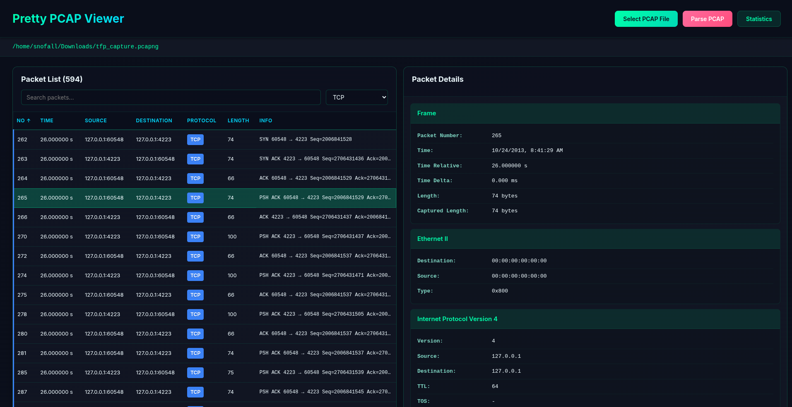
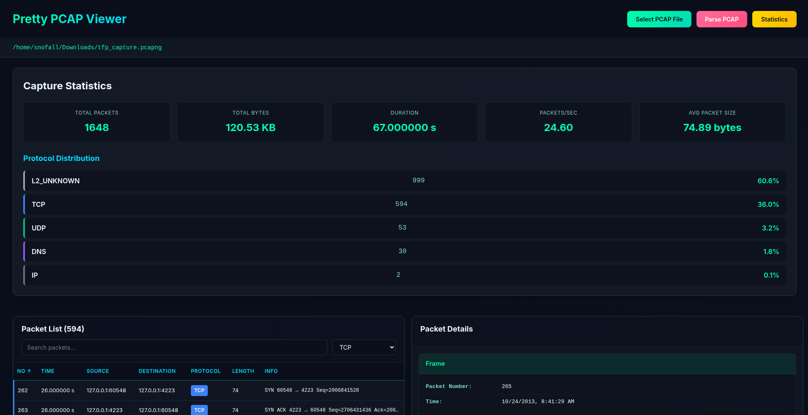

# Pretty PCAP

Pretty PCAP is a desktop application for viewing `.pcap` and `.pcapng` files in a clean, modern, and user-friendly way. It aims to provide **all the packet data you would expect from a traditional packet analyzer**, while presenting it in a visually appealing and easy-to-navigate interface.





The core flow is simple:

1. Select a PCAP / PCAPNG file  
2. Parse the file  
3. View packet data in a rich, readable UI  

---

## Features

- **Desktop application** built with Electron
- **React-based frontend** for a modern UI
- **Python backend** for reliable PCAP parsing
- Supports `.pcap` and `.pcapng` files
- **Displays packet metadata**
- **Displays packet payload**
- **Color-coded packets** by protocol (TCP, UDP, ARP, etc.)
- **Scrollable, large-file-friendly** packet table

---

## Backend (Python / Flask)

The backend is responsible for parsing PCAP files and returning structured packet data as JSON.

### Setup

```bash
cd backend
python -m venv venv
source venv/bin/activate  # On Windows: venv\Scripts\activate
pip install -r requirements.txt
```

### Run the API

```bash
python api.py
```

The API runs locally on:

```
http://127.0.0.1:5050
```

### API Endpoint

**`POST /parse`**

Test Backend:

```
curl -X POST http://127.0.0.1:5000/parse   -H "Content-Type: application/json"   -d '{"file_path": "/home/user/pretty-pcap/backend/example.pcap"}'
```

---

## Frontend (Electron + React)

The frontend provides the desktop UI and communicates with the backend API.

### Setup

```bash
cd frontend/pretty-pcap
npm install
```

### Development Mode

Start the React dev server:

```bash
npm run dev
```

In another terminal, start Electron:

```bash
npm start
```

### How It Works

1. Electron launches a desktop window
2. React renders the UI inside Electron
3. User selects a PCAP file using a native file dialog
4. The file path is sent to the Flask API
5. The backend parses the file and returns packet data as JSON
6. React renders the packet data in a table with visual enhancements

---
### Packaging Mode
```bash
cd backend
python -m venv venv
source venv/bin/activate  # On Windows: venv\Scripts\activate
pip install -r requirements.txt
```

### Compile the backend into a single executable

```bash
pyinstaller --onefile api.py --name pretty-pcap-backend
```
### Bundle the backend & Build the final Electron executable

```bash
cd ../frontend/pretty-pcap
mkdir executable
```
- The backend executable we compiled earlier needs to go inside:
```bash
/frontend/pretty-pcap/executable
```

```bash
cd ../frontend/pretty-pcap
npm run package # compiles the react frontend & builds the final electron executable
```

- The final Electron executable can be found here:
```bash
/frontend/pretty-pcap/release
```

---

## Disclaimer

Pretty PCAP is a learning-focused and experimental project. It is not intended to replace professional-grade tools, but to explore better UI/UX patterns for packet analysis.

---

## License

This project is open source. Feel free to use, modify, and distribute as needed.

---

## Contributing

Contributions are welcome! Please open an issue or submit a pull request if you'd like to improve Pretty PCAP.
